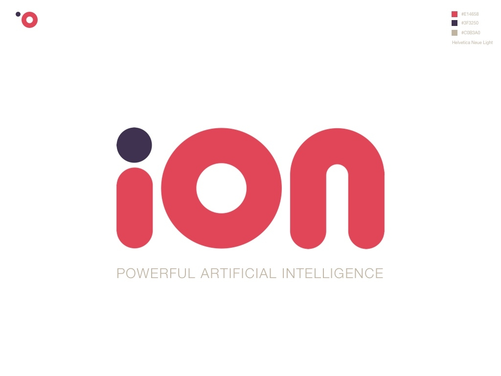
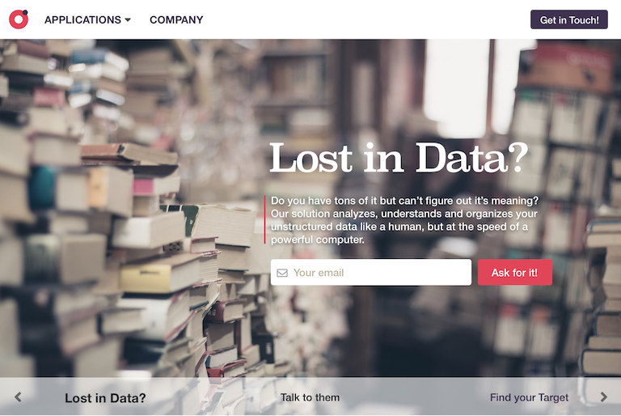

<!-- Main -->

<!-- One -->
<section id="one">
	

		<header class="major">
			<h1>iON Branding Concept</h1>
		</header>

		<!-- Content -->
		

			

				<ul class="alt">
					<li><b>Role:</b> Designer</li>
					<li><b>Tools:</b> Adobe Illustrator</li>
				</ul>
			

		

		<h2>Overview</h2>
		

			

			iON (Artificial Intelligence ON) is a concept for fictional company that sells services powered by what is known to be under the umbrella of Artificial Intelligence.
			

		

		

			

				

					
				

				

					
				

				

					
				

			

		

	

</section>

