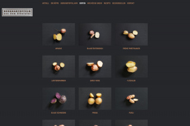
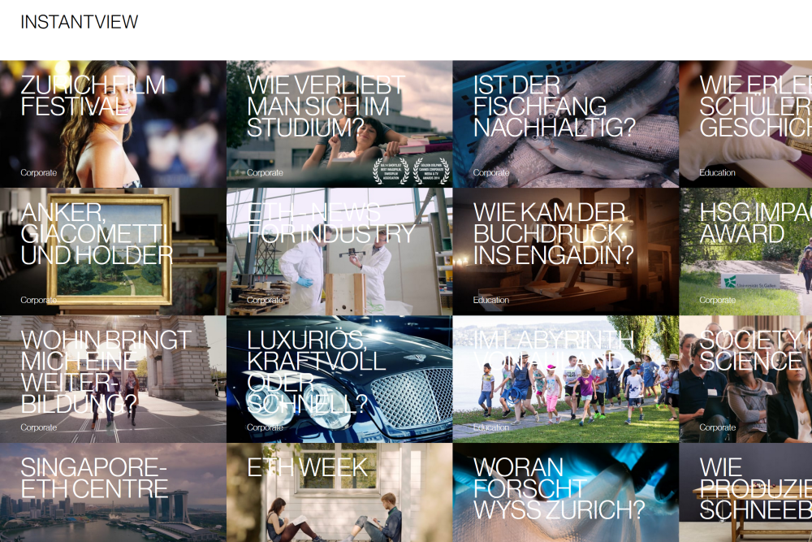
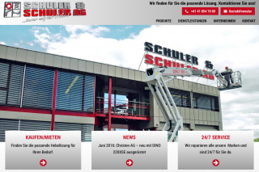
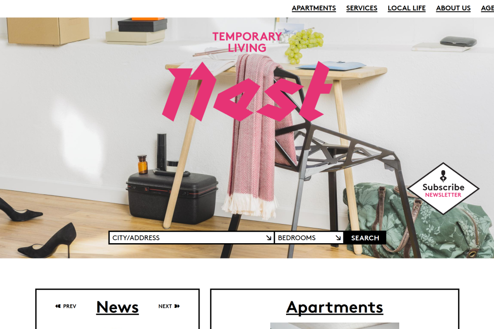
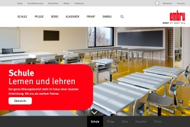
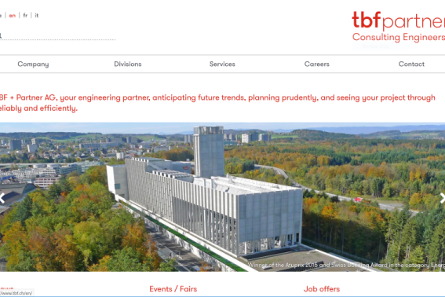

<!-- Main -->

<!-- One -->
<section id="one">
	

		<header class="major">
			<h1>FLX Labs Webstudio</h1>
		</header>

		<!-- Content -->
		

			

				<ul class="alt">
					<li><b>Role:</b> Frontend Developer</li>
					<li><b>Frontend technologies:</b> jQuery, PHP, Angular, CSS, Silverstripe CMS</li>
					<li><b>URL:</b> <a href="https://flxlabs.com/projekte/" target="_blank">https://flxlabs.com/projekte/</a></li>
				</ul>
			

		

		<h2>Overview</h2>
		

			This small studio delivers custom websites with creative concepts, targeted content and the proper technologies depending on each case. In FLX Labs I was involved in several projects, from brand new sites to existing ones that needed updates and extensions.
		

		<h2>Projects</h2>
		

			

				

					
				

				

					
				

				

					
				

				

					
				

				

					
				

				

					
				

			

		

		

			

				<ul class="alt">
					<li><a href="https://kunstlehrstuhl-bbb.ch/" target="_blank">Kunstlehrstuhl BBB</a></li>
					<li><a href="http://myneuland.com/" target="_blank">Neu Land</a></li>
					<li><a href="http://www.qiwauwau.ch/" target="_blank">Qi Wau Wau</a></li>
					<li><a href="http://demhimmelzunah.ch/" target="_blank">Dem Himmel zu Nah</a></li>
					<li><a href="http://jakob-rapperswil.ch/" target="_blank">Hotel Jakob Rapperswil</a></li>
					<li><a href="http://marcelbaumgartner.com" target="_blank">Marcel Baumgartner Architekten</a></li>
				</ul>
			

		

</section>

