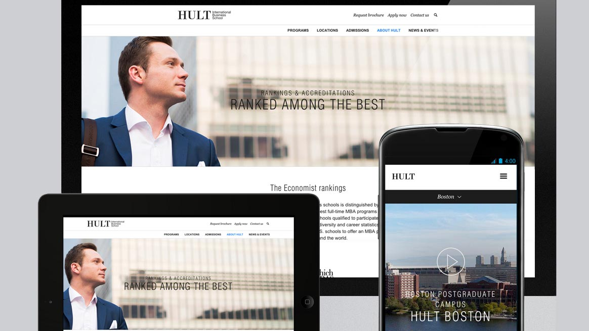

<!-- Main -->

<!-- One -->
<section id="one">
	

		<header class="major">
			<h1>Hult Business School</h1>
		</header>

		<!-- Content -->
		

			

				<ul class="alt">
					<li><b>Role:</b> Frontend Developer & Lead Frontend Developer</li>
					<li><b>Team:</b> Online Marketing</li>
					<li><b>Technologies:</b> jQuery, SASS/CSS, Sitecore CMS (.NET)</li>
				</ul>
			

		

		<h2>Overview</h2>
		

			

			
				
			
			

			

				

					I was hired as Frontend first and became Lead Frontend in the Online Marketing Team in Luzern office. The Project consisted in implement a redesign of the Corporate site that would allow more potential customers to sign for one of the Masters Courses of the School. The project involved a team of designers, UX designers, Frontend Developers and Backend Developers (in India)
				

				

					<i>* Unfortunately the website was redesigned and remplimented again, so our work is not online anymore.</i>
				

			

		

	

</section>

