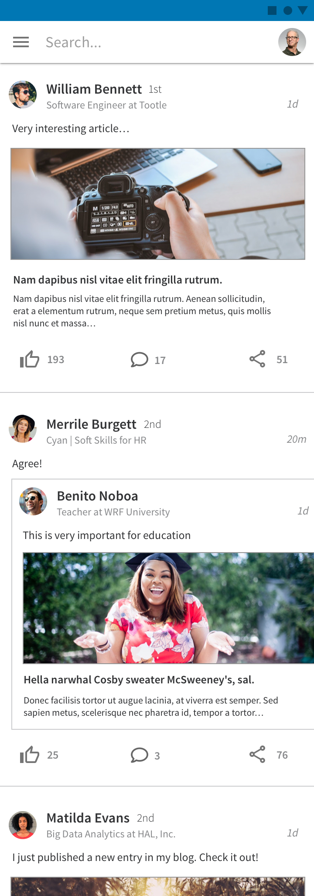
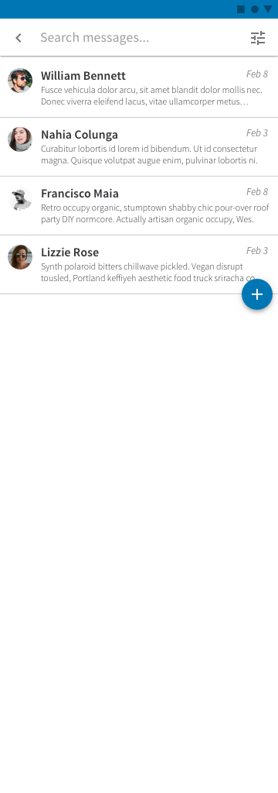

<!-- Main -->

<!-- One -->
<section id="one">
	

		<header class="major">
			<h1>LinkedIn Redesign</h1>
		</header>

		<!-- Content -->
		

			

				<ul class="alt">
					<li><b>Role:</b> UI Designer</li>
					<li><b>Tools:</b> Sketch</li>
				</ul>
			

		

		<h2>Overview</h2>
		

			

			LinkedIn is an awesome tool to connect professionals. It deals with a lot of information and it's not trivial how to present it. In my opinion current UI is a bit too full and needs some free space to breath and don't overwhelm the user. Here I present a redesign as an example of this liberation of space for clarity and ease of reading and navigation.
			

			

			Note: This design has been made following LinkedIn official brand guide (Typography and Colors).
			

		

		

			

				

					
				

				

					
				

				

					
				

			

		

	

</section>

