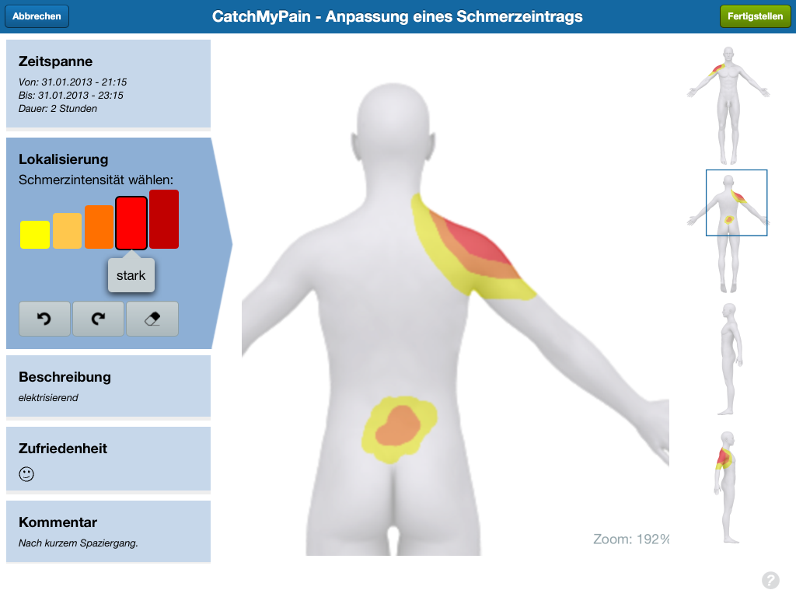
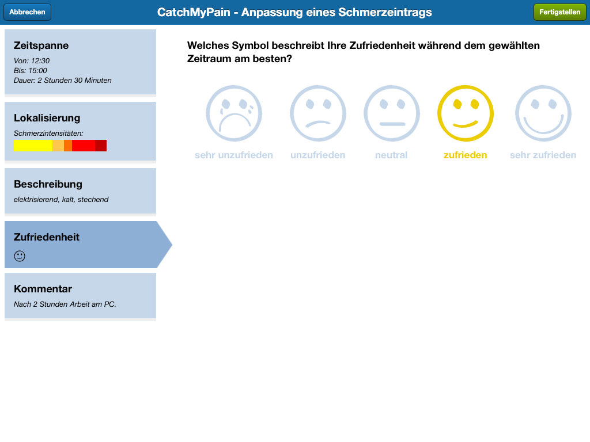
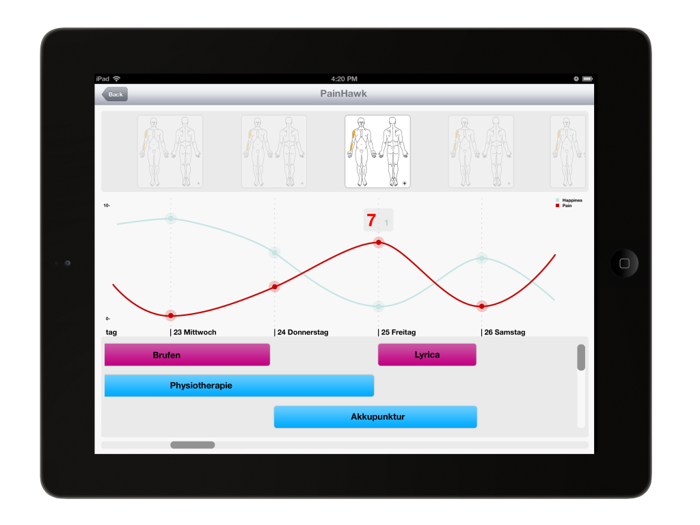

<!-- Main -->

<!-- One -->
<section id="one">
	

		<header class="major">
			<h1>Catch My Pain</h1>
		</header>

		<!-- Content -->
		

			

				<ul class="alt">
					<li><b>Role:</b> Frontend Developer & UI Designer</li>
					<li><b>Platforms:</b>
						<a href="https://itunes.apple.com/ch/app/catchmypain.com-das-schmerztagebuch/id578988873?ls=1&mt=8#" target="_blank">iPad</a>,
						<a href="https://play.google.com/store/apps/details?id=com.sanovation.catchmypain" target="_blank">Android</a>,
						<a href="http://my.catchmypain.com/" target="_blank">Browser (Chrome, Safari)</a>
					</li>
					<li><b>URL:</b> <a href="https://www.catchmypain.com" target="_blank">https://www.catchmypain.com</a></li>
				</ul>
			

		

		<h2>Overview</h2>
		

			CatchMyPain is an intelligent pain diary app that helps you keep track and express your pain, explain it to others and observe the success of your treatment. On top of all this, you can connect with similar patients and support the fight against pain.
		

		<h2>My role</h2>
		

			In Sanovation I was responsable of the User Interface design and part of the implementation. Some of the persona profiles included people with (obviously) chronic pain and seniors, so it was key to design a very intuitive and easy to use UI that would allow users to express their sensations every day.
		

		

			We came up with a solution using HTML5 canvas and several layers with transparency that allow users to easily paint using their finger on touchable screens which are the different parts of the body that have pain, and describe it.
		

		

			

				

				

				

			

		

		<h3>Technologies used</h3>
		<ul>
			<li><b>Design Tools:</b> Fluid UI, Photoshop</li>
			<li><b>Frontend programming:</b> Javascript, CSS, Sencha Touch</li>
		</ul>

</section>

