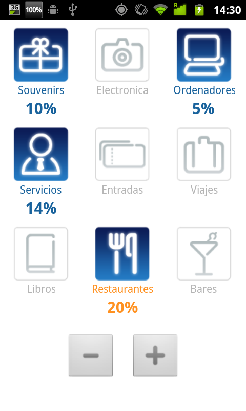
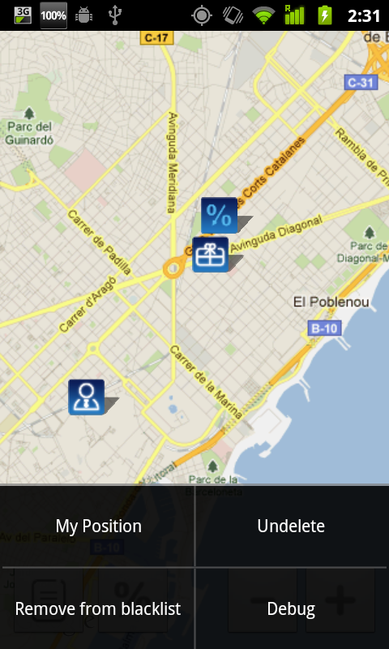

<!-- Main -->

<!-- One -->
<section id="one">
	

		<header class="major">
			<h1>Advertips</h1>
		</header>

		<!-- Content -->
		

			

				<ul class="alt">
					<li><b>Role:</b> Android Developer </li>
					<li><b>Team:</b> Multimedia Research Group</li>
					<li><b>Technologies:</b> Android</li>
				</ul>
			

		

		<h2>Overview</h2>
		

			As a part of the research in the Multimedia Group, we developed a prototype application for Android that geolocates shop discounts. The apps was highly configurable and allowed the user to filter by categories of interest, amount of discount, etc, and allowed to setup alerts when the user was passing nearby shops.
		

		

			

				

				

			

		

</section>

