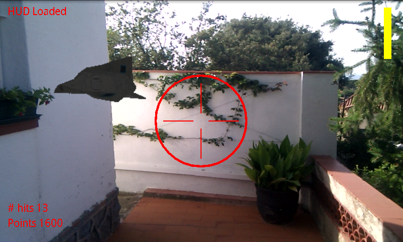
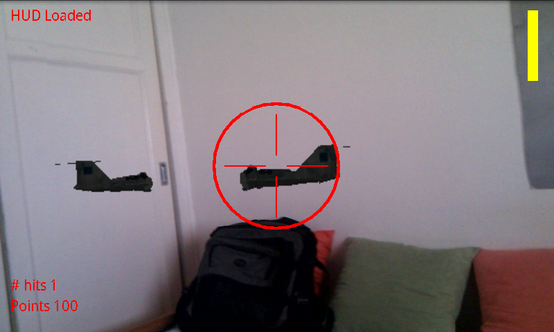
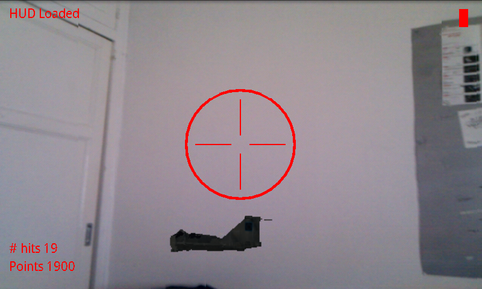

<!-- Main -->

<!-- One -->
<section id="one">
	

		<header class="major">
			<h1>AR Invaders</h1>
		</header>

		<!-- Content -->
		

			

				<ul class="alt">
					<li><b>Technologies:</b> Android, Open GL</li>
				</ul>
			

		

		<h2>Overview</h2>
		

			This is a project I did at university. It's a first approach to Augmented Reality games where the user looks for enemy spaceships around using the camera of the smartphone and tries to destroy as many as possible of them before being killed.
		

		

			The game renders simple starship 3D models with OpenGL and tracks the movements of the user using the sensors of the device. Depending on the position she can see them through the camera and try to shoot them down tapping on the screen.
		

		

			

				

				

				

			

		

</section>

