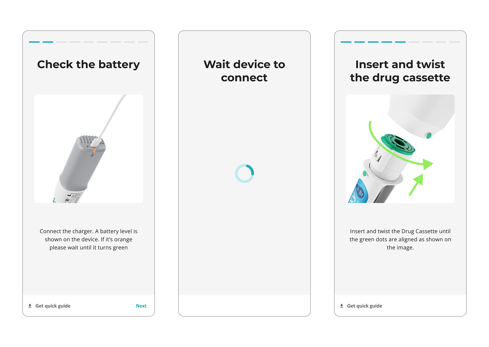

## Challenge: Bridging the physical-digital gap in medical onboarding

In medical administration, user attention must be centered on the patient and the device. Traditional onboarding apps require constant manual interaction (tapping, scrolling, clicking), which requires an important cognitive load and creates a dangerous "split-attention" effect.

The challenge was to design a digital experience that feels "magical", with a WOW effect. A system that could "sense" the user’s interaction with the medical device, freeing the user from worrying about the application.

## The process: A multidisciplinary approach

As the Lead UI/UX designer, I didn't just designedsome beautiful visuals and an interaction flow. I designed a syncronized system. My process involved epp integration accros three pillars:

### Concept & design leadership

Our persona analysis highlighted the need for an intuitive onboarding experience to accommodate varying levels of technical proficiency and high-distraction environments. Given the high stakes of a medical setting, we prioritized simplicity to mitigate the risk of user error and ensure patient safety.

For this I defined a new interaction model for the entire user journey. Instead of traditional navigation, I developed a state-driven logic where the medical device acts as the primary input. This required mapping every possible hardware state (Power On → Loaded drug → Injection In-Progress → Completion) to a corresponding UI response.

> The app acts as an observer of the device events, moving through the different steps only when the specific event has been confirmed.

### Cross-functional collaboration

I collaborated closely with differennt stakeholders through an iterative process to transform this concept into a polished, final product:

- With the product owner: I translated business requirements and user needs into intuitive user flows, periodically discussed with the product owner to ensure that the application complemented the use of the medical device.

- With developers: I collaborated closely with engineers to ensure the event-driven concept was technically viable. We worked to map the device's events to the web app, ensuring zero latency between the device and UI.

### Iterative User Testing & Validation

To ensure the concept worked in real-world conditions, I led user testing sessions with diverse demographics. We tested the "zero-touch" hypothesis to see how users reacted to an app that moved on its own. These sessions were critical in refining the transitions and validating the concept.

## Results: Minimizing Cognitive Load through Automation

The prototype successfully demonstrates a "hands-free" training workflow. By shifting the burden of navigation from the user to the device’s even data, we minimized manual touchpoints. This results in a safer, more intuitive user experience that keeps the patient's attention exactly where it needs to be.

The prototype was not just an internal tool. It was used to showcase and demo the possibilities of the Cloud-connected medical devices at multiple major industry events. Presenting it to industry experts allowed us to validate the product's unique value proposition in a live environment.
