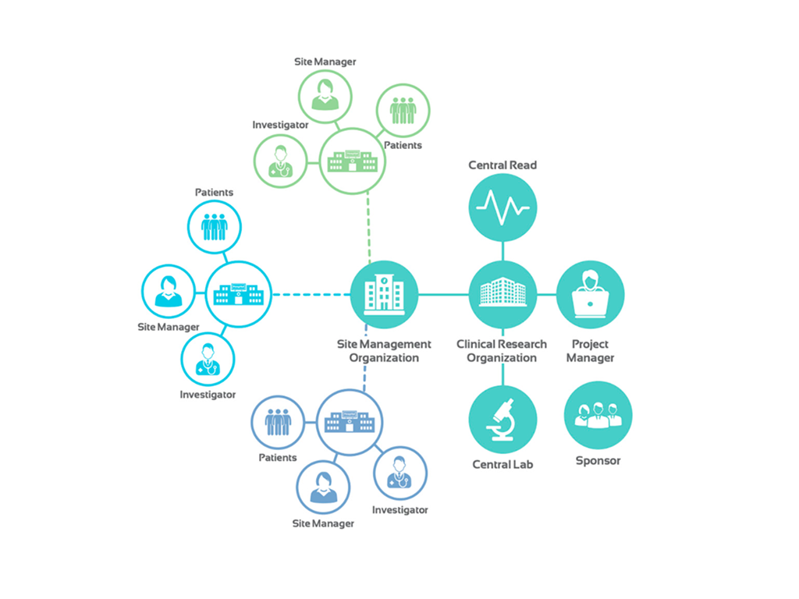

## Context

Connected medical devices are a relatively new frontier. Unlike mature IoT sectors (smart home, industrial), the medical device space lacks established workflows and shared mental models among users. Clinical trials are still done under supervision with traditional analog devices and data has to be registered manually. Operations teams still rely on spreadsheets, manual logs, and fragmented tooling to track devices and their activities.

This immaturity presented both a challenge and an opportunity: there were no known competitors to benchmark against, but other platforms exist in different consumer fields with established mental models we could lean on.

> There was no strong competitive benchmark to lean on. Patterns had to be established, not borrowed.

## The challenge

Clinical trials or medical monitoring can be high-stakes operations. Is common that they involve hundreds of sites accros dozens of countries, thousands of patients and tens of thousands of connected devices. Managing medical operations require an extensive number of different professionals with different tasks, goals and pain points.

The obtained data can determine wheter a drug gets approved or a treatment is correctly been supplied and is having the expected outcome.

When something goes wrong with a device — a firmware bug, a dead battery or an incorrect dosage — and nobody notices in time, the consequences cascade: missing data, protocol deviations, potentially months of delayed timelines costing millions and patient safety concerns.

## My process

When I joined the project as the unique designer, development was already underway and there was a will to deliver a working solution as quickly as possible. Because of this, I couldn’t apply the User-Centered Design (UCD) process in its full form. Instead, I had to adapt the methodology to fit an already-moving environment.

## Constraints That Shaped the Process

- Pre-Existing Technical Decisions: Architectural and technical choices were set before design or outside our area of influence. We had to work within fixed constraints, negotiating scope and improving usability without changing core structures.
- A Legacy of Poor UI Design: </b>The interface evolved without design oversight: inconsistent look & feel, duplicated functionalities and unclear architecture. The redesign needed major usability gains without disrupting established workflows.
- Unclear Personas and Limited Research Time: </b>The user base was diverse and loosely defined, with no formal personas. Limited research time made it hard to validate assumptions about goal and pain points.
- Prototype Testing Limitations: </b>Because the UI depended on real device telemetry, static prototypes couldn’t support meaningful usability testing until a later stage.

## Design approach

With limited formal research time, learning had to happen through alternative channels:

- Stakeholder interviews with product managers, device engineers, and customer success to reconstruct implicit knowledge about users.
- Analysis of internal documentation and other non-medical IoT platforms.
- Session observation of internal users operating the existing platform.
- Support ticket analysis to identify recurring pain points and confusion patterns (on later stages).

This wasn't a substitute for direct user research, but it built enough foundational understanding to make informed design decisions under time pressure.

## Rules and consistency: The design system

SHL.digital serves as the central hub for managing device fleets, though additional web applications were outlined as part of the broader ecosystem strategy. The development team was small but steadily expanding. Considering these factors, one of my initial proposals was to establish a design system that would provide a shared foundation—ensuring consistency while streamlining and optimizing both design and development processes.

## Personas

Working with product and customer-facing teams, we identified the key user archetypes based on what they need to do and what a they are responsible for. This produced provisional personas that drive design decisions while acknowledging they'd need validation and refinement over time.

- Observer: Only needs to check device's data and most of the time just high-level reports.
- Operator: Monitors fleet health daily, needs at-a-glance status, fast triage and batch processing.
- Technician: Provisions devices, manages firmware updates and troubleshoots technical issues.
- Administrator: Manages everything in a limited set of tenancies.
- SHL Administrator: Full-rights management across the whole platform.

## Quick iterations and validation

Working closely with the Product Owner, I led weekly alignment meetings to present iterative updates, gather feedback, and refine the solution based on evolving user pain points and business requirements. This continuous feedback loop allowed us to prioritize effectively, address usability challenges early, and ensure the product remained aligned with stakeholder expectations throughout development.

Once the MVP was deployed, we organized structured test trials with several pharma clients. These sessions provided valuable real-world insights, enabling us to validate our design and functional decisions under practical conditions. The feedback was very positive, confirming strong product-market fit and achieving a high success rate in meeting both user needs and operational requirements.

## Outcomes

The platform now allows hundreds of users to easily manage thousands of devices and track any issue in real-time.

- Users went from having no centralized view of device fleet health to a live dashboard showing status and exceptions. Problems that previously went unnoticed for days became immediately visible.
- A single interface that serves platform different roles, each seeing the right data at the right level of detail.
- The design system and component patterns created a foundation that subsequent features could build on consistently.

## Lessons learned

Working within constraints isn't a compromise, it's a design skill. This project was never going to have a textbook design process. Acknowledging that early and adapting the approach delivered far more value than insisting on ideal conditions.

Multi-tenancy is an information design problem, not just a permissions problem. Getting the scope filtering right was as important as any other design decision. The same data, presented at the wrong level of aggregation for a given user, is noise.
