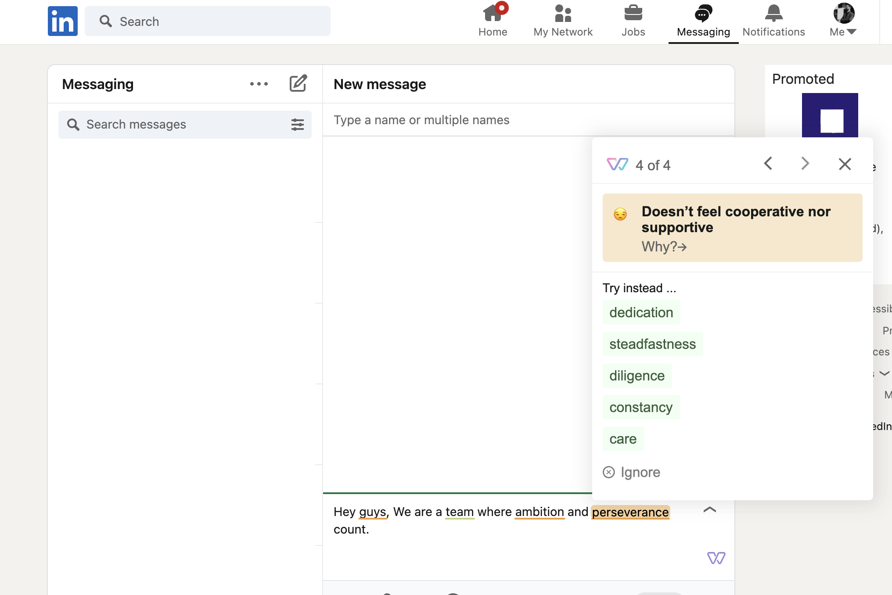
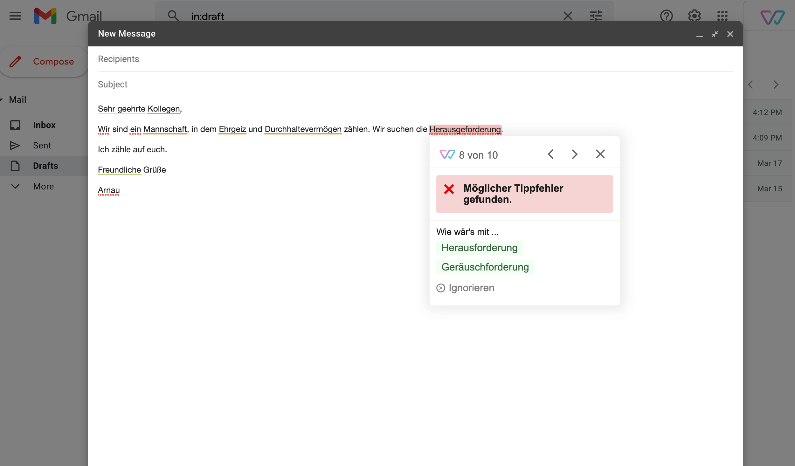
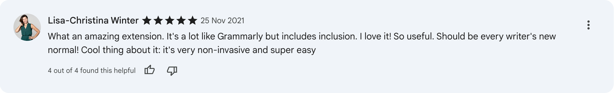
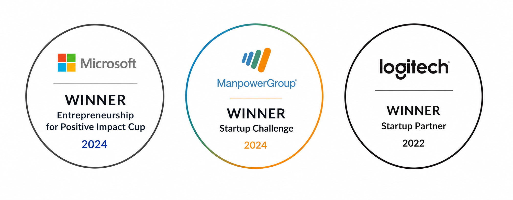

## Challenge

Everyday communication increasingly reaches global audiences, yet most writing tools offer no guidance on inclusive or unbiased language. Users writing across platforms — email, LinkedIn, job boards, internal tools — had no lightweight, real-time way to catch potentially exclusionary phrasing as they typed. The challenge was to build a solution that worked universally across the web, not just inside a single platform, while remaining unobtrusive and fast enough to keep up with natural typing speed.

Building a cross-browser extension introduced additional constraints: consistent behavior across Chrome, Firefox, and Edge, injecting into the DOM of arbitrary third-party sites without breaking layouts, and staying performant in memory-constrained browser environments.

## Actions

I joined as the founding engineer and took full ownership of the browser extension architecture. I built the browser extension from scratch using TypeScript and React, implementing a layer that could detect active text inputs on virtually any website and hook into user keystrokes without interfering with the host page's own DOM.

The core experience was a real-time analysis pipeline: as the user typed, input was streamed to a REST API backed by an NLP model. Suggestions appeared inline as non-blocking UI overlays — lightweight enough to avoid perceptible lag.

I also built the extension's settings panel and onboarding flow, and established all the build pipelines to deploy the browser extensions in the different stores.

Close collaboration with the ML engineer and UI Designer shaped how suggestions were surfaced — balancing frequency, confidence thresholds, and tone to avoid making the tool feel intrusive or preachy.

## Results

Witty launched across Chrome, Firefox, and Edge within 3 months of the project starting. The extension grew with frequent updates to over 10,000 active users and delivered 166% revenue growth in the first 18 months after launch.

User satisfaction was consistently high, with store ratings above 4.5 — reflecting both the quality of the core experience and the care taken to make the extension feel native across any website.

The project received significant recognition within the technology and accessibility communities, earning multiple awards for its unique approach to improving online writing and reducing bias in workplace communication.

Although the company behind Witty Works ultimately closed its doors, I remain incredibly proud of what it achieved. One of its most meaningful legacies is that <a href="https://www.witty.works/en/blog/witty-goes-open-source" target="_blank" rel="noopener noreferrer">the project was released as open source</a>, allowing the wider community to continue building on its mission and ensuring that its impact can live on beyond the original business.
